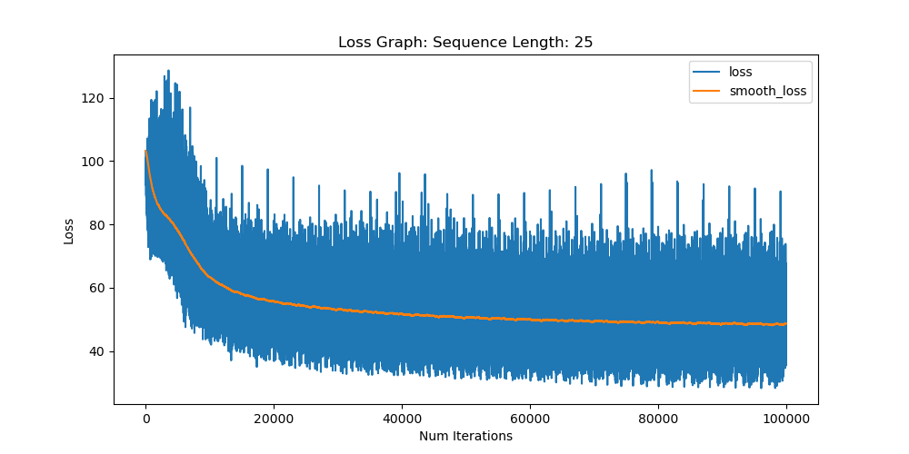

# LSTM_from_scratch
## LSTM variants implemented from scratch (numpy)

This repo is an implementation of variants of LSTM architectures from scratch to produced Character-level
sequences trained on a Shakespeare play. 

Variants Implemented:
* Classic LSTM
* LSTM with peephole connections

To train architecture :
```
python main.py
```

